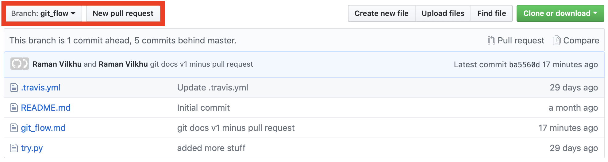
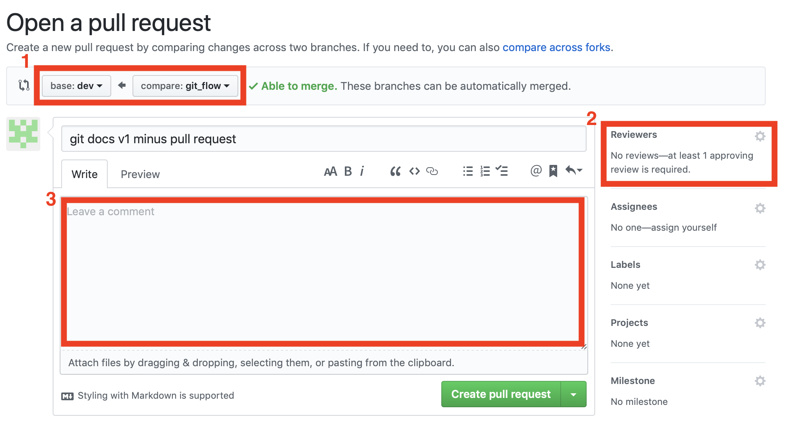

# Artificial Retina Git Flow Tutorial

## Setup
Create a working copy of a local repository by running the command:
```
git clone [path/to/repo]
```
Once you have cloned the repository, you should see a root directory named [repo name], move into this directory then run:
```
git status
```
Console output should read: 
> On branch master
> Your branch is up to date with 'origin/master`

**Important:** __DO NOT__ make any changes to or work on `master`. So the first thing you want to do is go over to `develop`, this is where you can make branches for any features you would like to add. 

Run command to switch branch to `develop`:
```
git checkout develop
```
Once again, run **git status** and ensure you are now on `develop` and up-to-date with `origin/develop`

## Branching
#### Creating a new branch
Whenever you want to add a feature (start working on some code you'd like to add), it is common practice to create a new branch off of `develop`

**Note:** Branch naming convention is extremely important! Please pick concise names, but someone not working directly with you should still have a good idea of what feature a particular branch is working on just from the name. 

First, ensure you are on `develop` and are up-to-date with `origin/develop`
If you are not up-to-date, run the command:
```
git pull
```
Next, create branch named "feature_x" by running the command:
```
git checkout -b feature_x
```
This will create `feature_x` and automatically switch you to using this branch. 
#### Switching branches
In order to see all the availible branches, use the command: 
```
git branch -a
```
In order to switch to a branch, use the command:
```
git checkout [branch name]
```
#### Deleting a branch
In the event that you need to delete a branch, use the command:
```
git branch -d [branch name]
```
**Note:** While it is possible to recover a deleted branch, ideally you don't need to do this so make sure you truly intend to delete a branch before using this command!

#### Pushing a branch
If you create a local branch, it is _not available_ to others on the git repo unless you push it to the remote repository. To do this, use the command:
```
git push origin [branch name]
```
Now, anyone working on the remote repository will be able to see you branch and checkout that branch to work with you on it.

**Note:** You must be a collaborater on the github repository page in order to push your local branches to the origin. So, if you get a `permission denied` error while trying to push your branch to the origin, please reach out to the repository owner to be added as a collaborater! 


## Updating and Merging
#### Adding changes
In general, git keeps track of two file types on your working local repository: untracked and tracked files. Untracked files refer to saved files on your local repository that you have edited or modified.

Once you have created a new feature branch and have started writing code or making changes, the next step is to add these proposed changes. To view the status of these untracked chnages, use the command `git status`. Here you should see all the local changes you have just started to make as `untracked files`. Next, you should add these changes to your `tracked files`, which means you are staging them to be commited (i.e you intend to add them to the shared repository). This is done using the following command:
```
git add [file name]
```
Or alternativly to stage all the files listed in the `git status` untracked files list with one command, you can use:
```
git add *
```
Now, you can check to make surre all the right files are staged to be commit by using the command `git status` and you should see all the files you hope to update on the repository in green. 

Note, while checking the staged files, if you see files that you **do not intend to update on the repository** you can always unstage them using the command:
```
git reset HEAD [file name]
```
**PLEASE ENSURE THE RIGHT FILES ARE STAGED BEFORE PROCEEDING**

#### Commiting changes 
Now that you have all the edited files you hope to update on the repository staged, you must issue a commit. Essentially, a commit groups these staged changes, assigns a unique commit ID, includes a short message of what the changes do, and records all of this to the overall log of records for a repository. Hence, it is **extremely** important when developing a personal workflow that works best for you to keep in mind the overarching idea of using commits as a way to group together and record file changes corresponding to a particular feature update you are working on. In order to commit your staged changes, use the command:
```
git commit -m "commit message, please keep this concise but descriptive"
```
Now, once you have your changes committed, the last step is to push your branch to the origin one last time, see above (`git push origin [branch name]`). Now, when you go to the project's github page you should be able to see your branch in the list of remote branches and all that is left is conducting a pull review in order to merge your changes into `develop`.

#### Pull requests to merge feature branch 
In order to push your changes to the repository, you must submit a `pull request`, which is easiest done using the github web interface. 

From the repository page, show below, make sure you have selected the branch you wish to merge and then click on `New pull request`



Next, you should see the following page:



On this page, you must edit 3 things:
1. Ensure that the "compare" branch is set to your feature branch. Additionally, ensure the "base" branch is set to branch you intend to merge to, most of the time this should be `develop`. 
2. Assign a minimum of 1 reviewer. This person will parse through your changes and sign off on any changes you made before allowing you to merge your changes. Ideally, you should assign 2 code reviewers as good practice. 
3. Write a comment detailing what group of commits make up your feature branch that you wish to merge into the repository. Please make sure this is more detailed than just a sum of all the commit messages you've written for the branch up to this point -- ideally someone unfamiliar with your feature should get a good idea for what you've changed just by reading this comment. 

Finally, you are ready to push your code, simply just hit the `create pull request` button and wait for any comments/suggestions from your reviewers before merging the code :)

